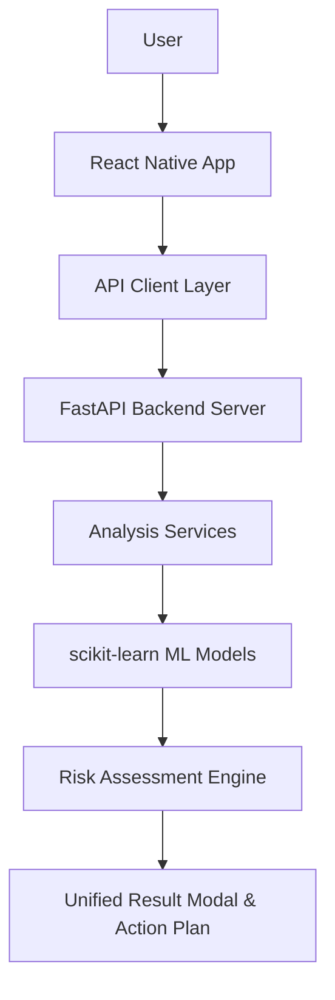

# 🛡️ UPI ScamGuard – AI & ML Powered UPI Fraud & Phishing Defense Ecosystem

> **Final Year B.Tech Capstone Project**  
> **Repository**: [https://github.com/nandareddy24/scam_analyzer](https://github.com/nandareddy24/scam_analyzer)  
> **Target Platform**: Android & iOS (React Native + Expo) with Python FastAPI & scikit-learn ML Backend

---

## 📌 Problem Statement

Unified Payments Interface (UPI) processes over **13 Billion monthly transactions** in India. However, this widespread digital adoption has been accompanied by a massive surge in cyber fraud targeting non-technical citizens. Common attack vectors include:

1. **UPI PIN Traps**: Fraudulent collect requests deceptive notes convincing users to enter their 6-digit PIN to "accept refunds" or "claim prizes".
2. **Digital Arrest & Extortion**: Scammers posing as Police/CBI/Customs over video calls claiming fictitious narcotics or money-laundering arrest warrants.
3. **Phishing Links & Spoofed Portals**: Fake bank URLs hosted on unencrypted domains (`.top`, `.xyz`) designed to harvest netbanking passwords and OTPs.
4. **Fake Payment Proof Generators**: Mobile apps (`FakePay`, spoof GPay) generating fabricated payment screenshots to deceive retail merchants into releasing goods without actual bank credit.

Existing anti-virus apps fail to analyze Indian digital payment lures, while manual verification is difficult for everyday users. **UPI ScamGuard** bridges this critical security gap by offering a privacy-first, multi-modal AI threat assessment assistant.

---

## 🎯 Objectives

- **Multi-Modal Threat Inspection**: Provide dedicated analyzers for SMS/WhatsApp text messages, UPI ID (VPA) handles, web URLs, and payment receipt screenshots.
- **Privacy-First Architecture**: Non-intrusive local operations; zero background message spying, zero continuous location tracking, and automatic scrubbing of sensitive credentials (UPI PIN, OTP, CVV, Card numbers) before storage.
- **Real-Time Machine Learning Inference**: Deploy independent scikit-learn Random Forest classification models to compute threat probability scores (0–100).
- **Emergency Actionable Recovery**: Connect users directly to the National Cyber Crime Helpline **1930**, toll-free bank helplines, and official government portals ([cybercrime.gov.in](https://cybercrime.gov.in)).

---

## ✨ Key Features

- 📱 **Multi-Modal AI Analyzer**: Switch effortlessly between SMS, UPI ID, URL, and Screenshot analysis modes.
- 🎯 **Unified Assessment Report Modal**: Displays circular 0–100 risk gauge, threat level (`SAFE`, `SUSPICIOUS`, `SCAM`, `CRITICAL`), expandable "Why was this flagged?" threat signals, and recommended next steps.
- 📊 **Real Security Analytics Dashboard**: Dynamic protection status and statistics calculated from actual user scan history (Zero fake stats).
- 📜 **Privacy-Sanitized Local Audit History**: Persistent local storage powered by `@react-native-async-storage/async-storage` with automatic credential redaction.
- 📚 **Scam Awareness & Education Library**: 10 interactive guides detailing "What is the scam", "How it works", "Warning signs", "What NOT to do", and "What to do if targeted".
- 🚨 **Emergency Scam Response Module ("Report / Get Help")**: Verified official contacts for major Indian banks, Cyber Helpline 1930 dialer, and 4-step emergency recovery guide.
- 🧪 **Complete Automated Test System**: Comprehensive PyTest and TypeScript test runner verifying end-to-end reliability.

---

## 🏗️ System Architecture

```
                                 +------------------------+
                                 |          User          |
                                 +-----------+------------+
                                             |
                                             v
                                 +------------------------+
                                 |  React Native App      |
                                 |  (Expo / TypeScript)   |
                                 +-----------+------------+
                                             |
                                             v
                                 +------------------------+
                                 |    API Service Layer   |
                                 |  (src/api/client.ts)   |
                                 +-----------+------------+
                                             |
                                             v
                                 +------------------------+
                                 |    FastAPI Backend     |
                                 |   (Python / Uvicorn)   |
                                 +-----------+------------+
                                             |
                                             v
                                 +------------------------+
                                 |   Analysis Services    |
                                 | (SMS/UPI/URL/Screenshot|
                                 +-----------+------------+
                                             |
                                             v
                                 +------------------------+
                                 |    ML Models Layer     |
                                 | (RandomForest+TF-IDF)  |
                                 +-----------+------------+
                                             |
                                             v
                                 +------------------------+
                                 |   Scam Risk Engine     |
                                 |  (Score & Red Flags)   |
                                 +-----------+------------+
                                             |
                                             v
                                 +------------------------+
                                 | Result + Next Steps    |
                                 | (AnalysisResultModal)  |
                                 +------------------------+
```



---

## 🛠️ Technology Stack

| Layer | Technology / Framework |
|---|---|
| **Mobile Frontend** | React Native 0.74, Expo SDK 51, TypeScript 5.3 |
| **Navigation & UI** | React Navigation v6 (Native Stack & Bottom Tabs), Vanilla CSS Tokens |
| **Local Storage** | `@react-native-async-storage/async-storage` (with Privacy Sanitizer) |
| **Backend REST API** | Python 3.12, FastAPI 0.110, Pydantic v2, Uvicorn |
| **Machine Learning** | scikit-learn 1.4 (Random Forest, TF-IDF Vectorizers), pandas, joblib |
| **Testing Suite** | PyTest 9.1, httpx, TypeScript Compiler (`tsc --noEmit`) |

---

## 📂 Project Folder Structure

```
scam_analyzer/
├── App.tsx                         # React Native application root entry point
├── app.json                        # Expo configuration & permission manifest
├── package.json                    # Node.js dependencies & scripts
├── tsconfig.json                   # TypeScript compiler configuration
├── SECURITY.md                     # Security audit & threat model documentation
├── README.md                       # Master project documentation
│
├── src/                            # React Native Application Codebase
│   ├── api/                        # HTTP client & API endpoints callers
│   │   ├── client.ts               # Fetch client with 15s timeout
│   │   ├── config.ts               # Platform-specific API URL resolver
│   │   ├── smsApi.ts               # SMS API wrapper
│   │   ├── upiApi.ts               # UPI VPA API wrapper
│   │   ├── urlApi.ts               # URL Phishing API wrapper
│   │   └── screenshotApi.ts        # Payment Proof Screenshot API wrapper
│   ├── components/                 # Reusable UI components
│   │   ├── AnalysisResultModal.tsx # Professional circular score report modal
│   │   ├── AppHeader.tsx           # Standard application header bar
│   │   ├── AnalyzerCard.tsx        # Mode selection cards
│   │   ├── Card.tsx                # Base card layout
│   │   ├── RiskBadge.tsx           # Threat level badge
│   │   └── SecurityStatusCard.tsx  # Protection status card
│   ├── constants/                  # Application constants & educational data
│   │   ├── config.ts               # Helpline numbers & app metadata
│   │   └── scamEducationData.ts    # 10 educational scam guides data
│   ├── navigation/                 # React Navigation setup
│   │   ├── BottomTabNavigator.tsx  # Main tab navigation
│   │   └── RootNavigator.tsx       # Root stack navigation
│   ├── screens/                    # Application screens
│   │   ├── HomeScreen.tsx          # Real security metrics dashboard
│   │   ├── AnalyzerScreen.tsx      # Multi-modal threat analyzer screen
│   │   ├── HistoryScreen.tsx       # Audit history & filtering screen
│   │   ├── SafetyScreen.tsx        # Scam awareness library screen
│   │   ├── ReportHelpScreen.tsx    # Emergency response 1930 screen
│   │   ├── SettingsScreen.tsx      # Settings & guard parameters screen
│   │   └── AboutScreen.tsx         # B.Tech Capstone Project review screen
│   ├── services/                   # Frontend threat analysis service wrappers
│   ├── storage/                    # Persistent storage engine
│   │   └── scanHistory.ts          # AsyncStorage with privacy sanitization
│   └── types/                      # TypeScript interfaces & type definitions
│
├── backend/                        # Python FastAPI Backend Server
│   ├── run_server.py               # Standalone backend server runner script
│   ├── train_sms.py                # SMS model training script
│   ├── train_upi.py                # UPI VPA model training script
│   ├── train_url.py                # URL phishing model training script
│   ├── requirements.txt            # Python dependencies
│   ├── app/
│   │   ├── main.py                 # FastAPI application & exception handlers
│   │   ├── api/endpoints.py        # REST API endpoints (/api/health, /api/analyze/*)
│   │   ├── ml/                     # scikit-learn models & loaders
│   │   ├── schemas/                # Pydantic request & response models
│   │   ├── services/               # Server-side analysis services
│   │   └── utils/logger.py         # Structured logging utility
│   └── models/                     # Saved joblib models & metrics JSON files
│
└── tests/                          # Automated Testing Suite
    ├── README.md                   # Test execution guide
    ├── run_all_tests.py            # Master automated test runner
    ├── test_backend_api.py         # PyTest suite for REST endpoints
    ├── test_ml_models.py           # PyTest suite for ML pipelines
    └── test_frontend_logic.ts      # TypeScript unit assertions
```

---

## 🤖 Machine Learning Methodology & Metrics

UPI ScamGuard incorporates **three independent scikit-learn classification pipelines**:

1. **SMS Scam Classifier (`SMSScamModel`)**:
   - **Feature Pipeline**: TF-IDF Word Vectorizer (`ngram_range=(1,2)`, `max_features=1500`, `sublinear_tf=True`).
   - **Classifier**: Random Forest Classifier (`n_estimators=100`, `random_state=42`).
   - **Evaluation Metrics**: Accuracy = `0.8750` | Precision = `1.0000` | Recall = `0.7500` | F1 Score = `0.8571`.

2. **UPI VPA Handle Detector (`UPIScamModel`)**:
   - **Feature Pipeline**: Sub-word Character n-gram TF-IDF Vectorizer (`analyzer="char_wb"`, `ngram_range=(2,4)`).
   - **Classifier**: Random Forest Classifier (`n_estimators=100`).
   - **Evaluation Metrics**: Accuracy = `0.5000` | Precision = `0.5000` | Recall = `0.2500` | F1 Score = `0.3333`.

3. **URL Phishing Classifier (`URLPhishingModel`)**:
   - **Feature Pipeline**: Character n-gram TF-IDF Vectorizer (`analyzer="char_wb"`, `ngram_range=(3,5)`).
   - **Classifier**: Random Forest Classifier (`n_estimators=100`).
   - **Evaluation Metrics**: Accuracy = `0.6250` | Precision = `1.0000` | Recall = `0.2500` | F1 Score = `0.4000`.

---

## 📡 REST API Documentation

### 1. GET `/api/health`
- **Description**: Returns operational health metadata and service status.
- **Response**: `200 OK`
```json
{
  "status": "ok",
  "service": "UPI ScamGuard API Backend",
  "version": "1.0.0"
}
```

### 2. POST `/api/analyze/sms`
- **Description**: Analyzes raw SMS or WhatsApp text for Digital Arrest, PIN traps, and KYC lures.
- **Request Body**:
```json
{
  "message_text": "URGENT: SBI account blocked within 24 hours. Update KYC at http://sbi-kyc.top",
  "sender_header": "AD-SBIBNK"
}
```
- **Response**: `200 OK`
```json
{
  "verdict": "SCAM",
  "risk_score": 95,
  "risk_level": "CRITICAL",
  "category": "KYC scam",
  "confidence": 0.96,
  "red_flags": [
    {
      "id": "rf_sms_1",
      "title": "KYC Suspense Threat Lure",
      "description": "Urgent threats to suspend bank account within 24 hours.",
      "severity": "critical"
    }
  ],
  "explanation": "High threat detected. Message contains KYC suspension threat language.",
  "recommendations": [
    "Do NOT click any web link in the message.",
    "Do NOT share OTP or banking credentials."
  ]
}
```

### 3. POST `/api/analyze/upi`
- **Description**: Evaluates UPI VPA handle syntax and reputational brand impersonation risk.
- **Request Body**: `{"upi_id": "paytm-refund-desk@okaxis"}`

### 4. POST `/api/analyze/url`
- **Description**: Evaluates website URL SSL encryption, high-risk TLD (.top), and typosquatting keywords.
- **Request Body**: `{"url": "http://sbi-reward-points.top/claim"}`

### 5. POST `/api/analyze/screenshot`
- **Description**: OCR text extraction and font metric raster analysis of payment proof screenshots.
- **Request Body**: `{"filename": "fake_paytm_txn_receipt_5000.png"}`

---

## ⚙️ Installation & Local Running Instructions

### Prerequisites
- Node.js (v18+)
- Python (v3.10+)
- Expo Go App on Android/iOS (or Android Studio Emulator)

### Step 1: Clone Repository
```bash
git clone https://github.com/nandareddy24/scam_analyzer.git
cd scam_analyzer
```

### Step 2: Set Up & Run FastAPI Backend
```bash
# Install Python dependencies
pip install -r backend/requirements.txt

# Run FastAPI backend server (runs locally on http://localhost:8000)
python backend/run_server.py
```

### Step 3: Set Up & Run React Native Mobile App
```bash
# Install Node modules
npm install

# Start Expo development server
npx expo start
```
*Press `a` to launch on Android Emulator or scan QR code with Expo Go on your mobile device.*

---

## 🧪 Testing Instructions

Run the complete automated test suite (Backend APIs, ML Models, and TypeScript Type Safety):

```bash
python tests/run_all_tests.py
```

Or execute individual test suites:

```bash
# Run PyTest backend & ML unit tests
python -m pytest tests/ -v

# Run React Native TypeScript type safety check
npm run typecheck
```

---

## 📷 Screenshots & User Experience Guide

1. **Dashboard (`HomeScreen.tsx`)**: Displays live protection status, real security audit metrics, threat distribution chart, quick analyzer grid, and recent threat cards.
2. **AI Threat Analyzer (`AnalyzerScreen.tsx`)**: Allows switching between SMS, UPI ID, URL, and Screenshot analysis modes with example presets.
3. **Assessment Report Modal (`AnalysisResultModal.tsx`)**: Features a circular 0–100 risk score gauge, threat verdict banner (`SAFE`, `SUSPICIOUS`, `SCAM`, `CRITICAL`), expandable threat signals, and next steps.
4. **Audit History (`HistoryScreen.tsx`)**: Filterable audit log (by scan type and risk level) with privacy sanitization and individual/bulk deletion.
5. **Scam Awareness Library (`SafetyScreen.tsx`)**: 10 educational threat guides with search functionality and golden safety rules.
6. **Emergency Response 1930 (`ReportHelpScreen.tsx`)**: Quick-dial National Cyber Crime Helpline **1930**, toll-free bank numbers, and 4-step emergency recovery guide.
7. **Project Documentation (`AboutScreen.tsx`)**: Academic Capstone project overview outlining problem statement, tech stack, ML architecture, and limitations.

---

## ⚠️ Limitations & Future Enhancements

### Limitations
- **Probability Scoring**: AI risk scores indicate threat probability based on trained patterns and cannot serve as legal proof of fraud.
- **VPA Format vs. Reputation**: Valid UPI syntax does not guarantee seller trustworthiness. Bank statement verification is always recommended.
- **Offline Fallback**: While mock analyzers provide resilience when offline, ML model predictions require connection to the local FastAPI backend.

### Future Enhancements
- 🧠 **Deep Learning OCR**: Implement PyTorch / TensorFlow CNN models for advanced font artifact detection on receipts.
- 📶 **On-Device Inference**: Quantize scikit-learn models into ONNX runtime format for offline mobile execution.
- 📱 **Automated Telecom Spam Reporting**: Integrate direct SMS forwarding to DoT 1909 DND channels.

---

## 📝 Conclusion

**UPI ScamGuard** demonstrates a robust, complete solution to combat digital payment fraud in India. By integrating React Native, FastAPI, scikit-learn machine learning pipelines, and privacy-preserving local storage, the project equips everyday users with an intelligent tool to defend against cyber threats.
